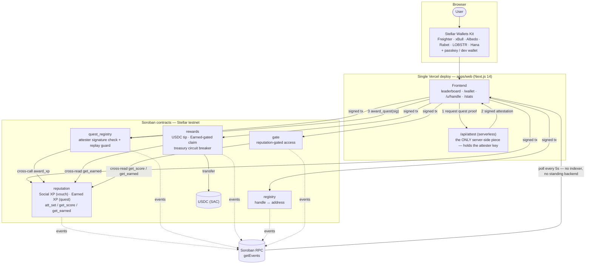

# 🛰️ alvinmunk

> **Collect people, not points.** A social, gamified, non-betting *proof-of-people* reputation game on Stellar/Soroban — built for the Rise In **Stellar Journey to Mastery** belt program (White → Master).

**▶ Live on Stellar testnet: [alvinmunk.vercel.app](https://alvinmunk.vercel.app)**

- You earn reputation through **mutual/social actions** (vouch for someone, complete a verifiable quest, tip) — not solo grinding.
- Badges name **other humans** and auto-generate a shareable card — reputation about *others* is viral; reputation about *yourself* is a résumé.
- Reputation is **spendable**: it unlocks bounties, ranking, and USDC micro-rewards.

**Demo video (2 min):** https://youtu.be/3FANRKLM6PI · **Live stats:** [alvinmunk.vercel.app/stats](https://alvinmunk.vercel.app/stats)

---

## Table of Contents

1. [Quick start](#quick-start)
2. [Architecture](#architecture-and-the-no-standing-backend-decision)
3. [What's implemented vs. TODO](#whats-a-working-skeleton-vs-a-todo)
4. [Documentation](#documentation)
5. [Belt submissions](#belt-submissions)
6. [Contributing](#contributing)
7. [License](#license)

---

## Quick start

### Prerequisites
- **Node ≥ 20** + **pnpm 9** (`corepack enable && corepack prepare pnpm@9 --activate`)
- **Rust stable** + `wasm32-unknown-unknown` target
- **Stellar CLI**: `cargo install --locked stellar-cli` (or `brew install stellar-cli`)

> ⚠️ **Pin versions before first build.** The dependency versions in `contracts/Cargo.toml` (`soroban-sdk`) and `apps/web/package.json` (`@stellar/stellar-sdk`, `smart-account-kit` for passkey, `@stellar/freighter-api` + `@albedo-link/intent` for the `/wallet` connect modal) are best-effort and should be verified against the latest releases — these libraries move fast.

### 1. Install JS deps
```bash
pnpm install
```

### 2. Build + test everything
```bash
pnpm contracts:build      # stellar contract build (wasm32v1-none)
pnpm contracts:test       # cargo test — 6/6 reputation tests
pnpm typecheck && pnpm test   # web + shared: tsc + vitest (16 tests)
pnpm -C apps/web build    # next build
```

### 3. Run the app locally (no infra needed)
```bash
cp .env.example apps/web/.env.local   # optional; testnet defaults work as-is
pnpm dev                              # turbo -> next dev
```
**Onboarding works out-of-the-box on testnet** via a **dev wallet** (ephemeral keypair, Friendbot-funded) — Face ID / passkey kicks in once you set `NEXT_PUBLIC_WALLET_WASM_HASH` + `NEXT_PUBLIC_LAUNCHTUBE_URL`. The dev wallet is hard-disabled on mainnet.

### 4. Deploy contracts to testnet
```bash
stellar keys generate --fund admin --network testnet
stellar keys generate --fund attester --network testnet
USDC_SAC=<your_usdc_sac_id> ADMIN=admin ATTESTER=attester ./scripts/deploy-testnet.sh
```
Copy the printed `NEXT_PUBLIC_*` ids into `apps/web/.env.local` (template: [`.env.example`](./.env.example)).

**Full "deploy your own" runbook** (keys → contracts → `.env.local` → web app → optional attester/faucet/passkey secrets): [`docs/DEPLOY.md`](./docs/DEPLOY.md).

---

## Architecture (and the "no standing backend" decision)

**[Jump to the diagram ↓](#system-diagram)** — five contracts, their cross-calls, the serverless attester, and the RPC-direct read path in one picture.

```
alvinmunk/                # project root (the repo)
├─ belts/                 # strategy + roadmaps (00-strategy + 08-anti-sybil are source of truth)
├─ docs/                  # full documentation index → docs/README.md
├─ contracts/             # Soroban (Rust) workspace — 5 contracts
│  ├─ reputation/         #   Social vs Earned XP (two-track), async vouches, attestations
│  ├─ quest_registry/     #   allowlisted-attester verifiable quests + replay guard
│  ├─ rewards/            #   USDC tip + Earned-gated payout (the spend sink)
│  ├─ registry/           #   handle ↔ address mapping
│  └─ gate/               #   reputation-gated access control
├─ apps/web/              # Next.js 14 — frontend + serverless attester (API route)
│  ├─ src/lib/            #   wallet (passkey + dev fallback), stellar, genesis, profile
│  └─ src/app/api/attest/ #   the ONLY server-side piece (holds attester key)
├─ packages/shared/       # TS types, event schemas, schema ids, art engine, contract registry
└─ scripts/               # deploy-testnet.sh (deploy + wire all 5 contracts)
```

**Backend?** No separate, always-on host. The only server-side need — the **attester signing key** — lives in a **Next.js serverless API route** (`/api/attest`), so it ships as one Vercel deploy. The MVP **leaderboard reads RPC `getEvents` directly**; a durable indexer is deferred until scale demands it (Blue/Black belt). See `belts/00-strategy.md`.

### On-chain design (why it's lean)
- **Two-track reputation (anti-sybil keystone, `belts/08-anti-sybil`):** **Social XP** (from vouches) is non-cashable — leaderboard/fun only; **Earned XP** (from attester-verified quests) is the *only* track `Rewards` reads to gate USDC. Vouches are `first-pair-only` (repeat pairs mint the card but grant 0 XP).
- **XP/badges = account-keyed contract storage**, non-transferable by the *absence* of a transfer fn (SBT semantics) — no per-badge NFT minting.
- **Oracle = allowlisted attesters with signed claims**, not a decentralized oracle.
- **Canonical `att_set` event emitted from day one** — append-only and retroactively impossible. This keeps the "reputation primitive" SCF door open for ~free; the `get_attestation`/`get_score`/`get_earned` read-views are pure adapters, never a second write path (`belts/00-strategy §4`).

### System diagram



The frontend never talks to a database or a custom API server for reads — the leaderboard, activity feed, and `/stats` poll Soroban RPC's `getEvents` directly. The only write-side server code is `/api/attest`, which signs quest claims with the allowlisted attester key and ships as part of the same Vercel deploy (steps 1–3 above); everything else is a wallet-signed transaction straight to a contract.

---

## The core loop (north-star)

```
mint_vouch (async half-card)  →  share link = install funnel  →  claim_vouch (both earn XP)
        →  stake/quest  →  rank unlocks reward  →  tip / claim_reward in USDC
```

North-star metric: **Verified Value Loops / week** — a vouch staked & redeemed into USDC by a *different*, proof-of-funding-verified user, where the USDC was backed by real external value (`belts/08-anti-sybil`). Raw "closed loops" is a vanity sub-metric only.

---

## What's a working skeleton vs. a TODO

| Area | Status |
| --- | --- |
| `reputation` (two-track Social/Earned, async vouch mint/claim, first-pair guard, attester award, `att_set`, read views) | ✅ implemented + 6 unit tests |
| `quest_registry` (allowlist, replay guard, cross-call to reputation) | ✅ implemented |
| `rewards` (tip, Earned-gated claim, pause) | ✅ implemented |
| Monorepo / CI / deploy script / shared types + art engine | ✅ |
| **Sprint 1 / White belt**: wallet (passkey + dev fallback), onboarding, first on-chain tx (Genesis), Genesis Stamp art, profile | ✅ implemented + vitest |
| **Sprint 2 / Yellow belt**: `reputation` deployed to testnet; vouch mint/claim wired; leaderboard from `social` events (RPC-direct, 5s poll); event schema frozen | ✅ implemented + verified on-chain (social 10/10, earned 0/0) |
| Serverless attester `/api/attest` | 🟡 transport + structure done; **evidence verification stubbed** (Orange belt) |
| Passkey provider (`connectPasskey`) | 🟡 dev-wallet fallback works now; **wire passkey-kit** for FaceID (White belt infra) |
| Handle → address resolution | ✅ live in Tip (type `@handle`, registry resolves on-chain); vouch still address-based |
| Indexer | ⏸ deferred (RPC-direct for MVP) |

Each TODO references the belt doc that owns it. Build order follows the belts/sprints: see [`docs/SPRINTS.md`](./docs/SPRINTS.md). **Sprints 0–2 done; Orange + Green code complete** — all 5 contracts deployed + cross-contract verified on-chain, claim-secret vouch loop, real serverless attester (GitHub PR / referral tx), anti-sybil (claim-secret + per-day cap + asymmetric + first-pair + ring-flag), USDC tip rail + faucet, on-chain rank→reward table with treasury circuit breaker (daily cap + frozen set + proof-of-funding toggle), weekly streak, leaderboard snapshot cache. **134 tests green** (57 contract incl. property/fuzz + 59 web + 18 shared). Remaining for Orange/Green: public testers + 2-week live retention.

---

## Documentation

Full documentation index (grouped by audience): **[docs/README.md](./docs/README.md)**

Quick links:

| Doc | What it covers |
| --- | --- |
| **[User guide](./docs/USER_GUIDE.md)** | End-user walkthrough — onboard, vouch/claim, quests, tips, leaderboard, profile, FAQ |
| **[Technical blog](./docs/BLOG.md)** | How the sybil-resistant proof-of-people design works |
| **[Ecosystem contribution](./docs/ECOSYSTEM.md)** | Open-source / community: Drips Wave maintainer, 26 bountied issues, 15 merged external-contributor PRs |
| **[Security review](./docs/SECURITY_REVIEW.md)** | Self-audit — Scout + cargo-audit + cargo-deny + clippy; 0 exploitable issues |
| **[Deploy your own (testnet)](./docs/DEPLOY.md)** · **[Mainnet runbook](./docs/DEPLOY_MAINNET.md)** | Stand up a fresh instance; mainnet cutover checklist |
| **[On-chain event schema](./docs/ON_CHAIN_EVENTS.md)** | Frozen event shapes |
| **[Marketing kit](./docs/MARKETING.md)** · **[Pitch deck](./docs/pitch-deck.pdf)** | Launch thread + promotion; the designed deck |
| **[Product & Design](./docs/product/README.md)** | Brand, design system tokens, frontend pages, content, business model |

---

## Belt submissions

Belt-program submission evidence (screenshots, tx hashes, rubric tables) for White → Blue belts:
**[docs/BELT_SUBMISSIONS.md](./docs/BELT_SUBMISSIONS.md)**

The full product thesis, persona debates, and belt-by-belt roadmap live in **[`belts/`](./belts/)** — start with **[`belts/00-strategy.md`](./belts/00-strategy.md)** (source of truth).

---

## Two-project rule

This repo (alvinmunk) is the **Builder-Track / $20k** play and the user's **primary** project. A separate idea targets the Startup Track / SCF. Rule (`00-strategy §7`): **alvinmunk ships a demonstrable belt-loop increment every week before any SCF hour.** Share infra so alvinmunk work feeds the SCF project.

---

## Contributing

See [CONTRIBUTING.md](./CONTRIBUTING.md) for branch conventions, PR process, and code style.

---

## License

TBD.
